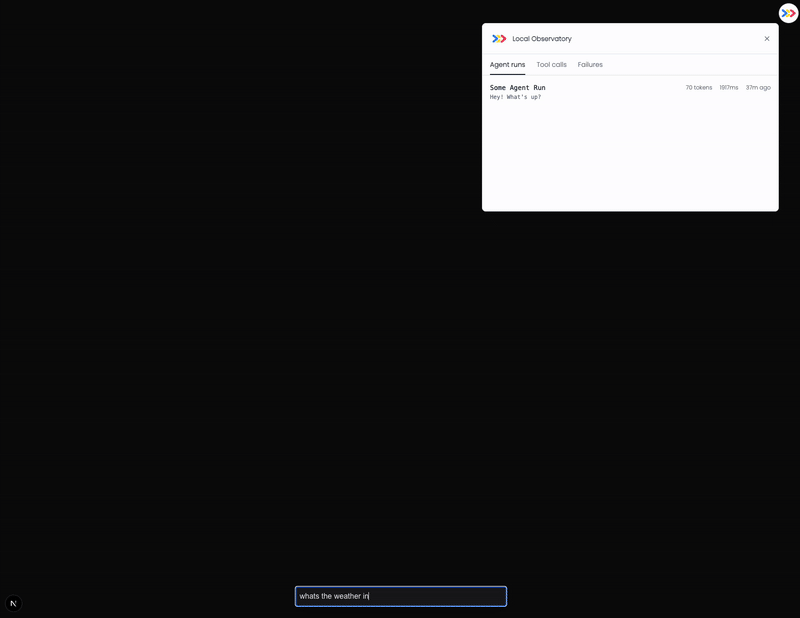

#  Observatory

[The Context Company](https://thecontext.company/) does agent observability. **We care deeply about DX; it’s our single biggest priority.**

Observatory is a monorepo containing core packages for AI agent observability:

- **[@contextcompany/otel](./packages/otel)** - OpenTelemetry integration for instrumenting AI SDK calls
- **[@contextcompany/widget](./packages/widget)** - Local-first UI overlay for visualizing AI agent traces in real-time
- **[@contextcompany/claude](./packages/claude)** - Instrumentation for Claude Agent SDK

## Local mode (AI SDK + Next.js)

Local mode allows you to run The Context Company in a local-first way. This is 100% open-source and requires **no account or API key**. To set up local mode, refer to the guide below or [our documentation](https://docs.thecontext.company/frameworks/ai-sdk/local).

**Local mode currently only supports Vercel AI SDK on Next.js**.



### Setup

#### Step 1: Install dependencies

```Title pnpm
pnpm add @contextcompany/otel @vercel/otel @opentelemetry/api
```

#### Step 2: Add instrumentation to Next.js

If you haven't already, add an `instrumentation.[js|ts]` file to your project, under the `app` directory. Call the `registerOTelTCC` function to instrument your AI SDK calls. Under the hood, this function calls the `registerOtel` from `@vercel/otel`.

See the [Next.js Instrumentation guide](https://nextjs.org/docs/app/guides/instrumentation) for more information on instrumenting your Next.js application.

```typescript instrumentation.ts
// instrumentation.ts
export async function register() {
  if (process.env.NEXT_RUNTIME === "nodejs") {
    const { registerOTelTCC } = await import("@contextcompany/otel/nextjs");
    registerOTelTCC({ local: true });
  }
}
```

#### Step 3: Add widget to layout

Add the Local Mode widget to the root layout of your Next.js application.

```tsx app/layout.tsx
// app/layout.tsx
import Script from "next/script";

export default function RootLayout({
  children,
}: {
  children: React.ReactNode;
}) {
  return (
    <html lang="en">
      <head>
        {/* add The Context Company widget */}
        <Script
          crossOrigin="anonymous"
          src="//unpkg.com/@contextcompany/widget/dist/auto.global.js"
        />
        {/* other scripts */}
      </head>
      <body>{children}</body>
    </html>
  );
}
```

#### Step 4: Enable telemetry for AI SDK calls

As of AI SDK v5, telemetry is experimental and requires the `experimental_telemetry` flag to be set to `true`. Ensure you set this flag to `true` for all AI SDK calls you want to instrument.

```typescript generateText
// route.ts
import { generateText } from "ai";

const result = generateText({
  // ...
  experimental_telemetry: { isEnabled: true }, // required
});
```

> [!NOTE]
> By default, The Context Company collects limited anonymous usage data when running local mode. **No sensitive or personally identifiable information is ever collected**. You can view exactly which events and values are tracked [here](https://github.com/The-Context-Company/observatory/blob/main/packages/otel/src/nextjs/telemetry/events.ts). To disable anonymous telemetry, set the `TCC_DISABLE_ANONYMOUS_TELEMETRY` environment variable to `true` in your Next.js project. Learn more about this in our [documentation](https://docs.thecontext.company/frameworks/ai-sdk/local#anonymous-telemetry).

### Contributing

- Looking to contribute? Check out our [contributing guide](./CONTRIBUTING.md) to get started.

### Acknowledgments

- Big thanks to [Anthony Hoang](https://github.com/anth0nycodes) for being an active contributor and maintainer!
- Special thanks to [@RobPruzan](https://github.com/RobPruzan) for helping with the design of the tool and being an early adopter.
- [React Scan](https://react-scan.com/) has a phenomenal DX and Preact widget that we took inspiration from.
- The implementation behind the [Next.js Devtools](https://github.com/vercel/next.js/tree/canary/packages/next/src/next-devtools) overlay widget was insightful.
